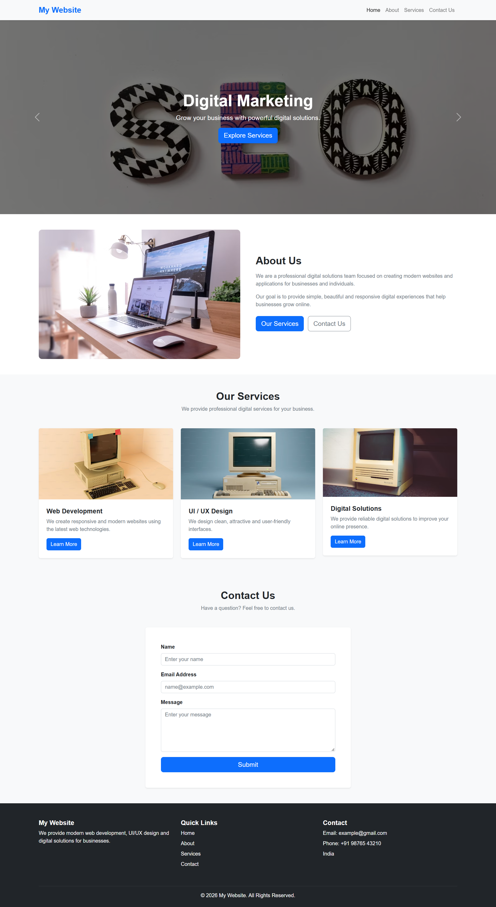

# 🚀 BootstrapNova

A modern, responsive and user-friendly website built using **HTML5, CSS3 and Bootstrap 5**.

BootstrapNova is a frontend practice project that demonstrates how Bootstrap components and responsive utilities can be used to build a clean business-style website.

---

## 🌐 Live Demo

🔗 **Live Website:**  
https://your-live-link-here.vercel.app/

> Replace the above link with your actual Vercel/GitHub Pages live URL.

---

## 📸 Website Preview



---

## ✨ Features

- 📱 Fully Responsive Design
- 🧭 Responsive Navigation Bar
- 🎞️ Bootstrap Hero Carousel
- 🏢 About Us Section
- 💼 Services Section
- 🃏 Responsive Service Cards
- 📩 Contact Form
- 🔗 Smooth Navigation Between Sections
- 📱 Mobile-Friendly Layout
- 🦶 Responsive Footer
- 🎨 Clean and Modern UI

---

## 🛠️ Technologies Used

- HTML5
- CSS3
- Bootstrap 5.2.3
- JavaScript
- Unsplash Images

---

## 📂 Project Structure

```text
BootstrapNova/
│
├── index.html
│
├── assets/
│   └── bootstrap-nova.png
│
└── README.md
